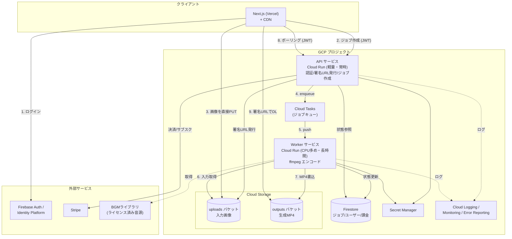
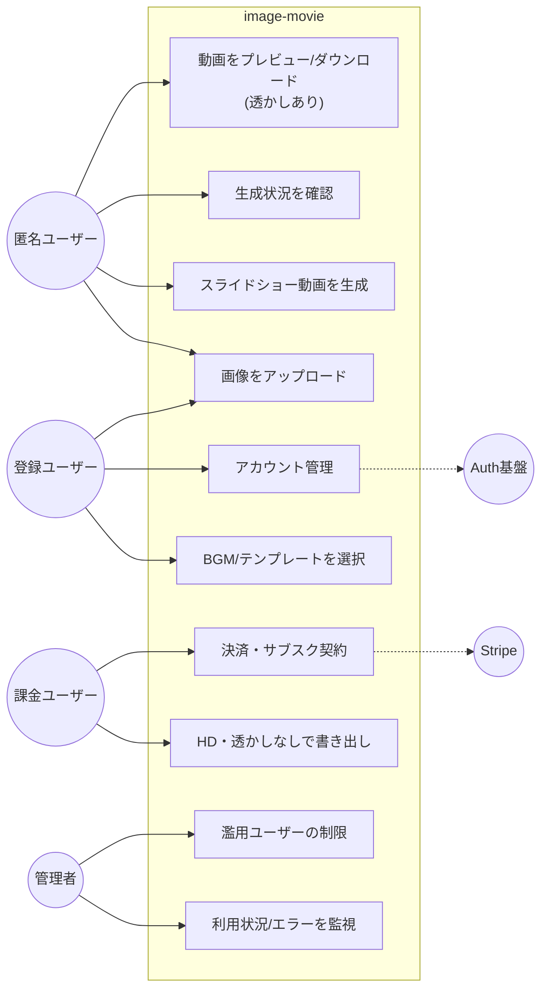
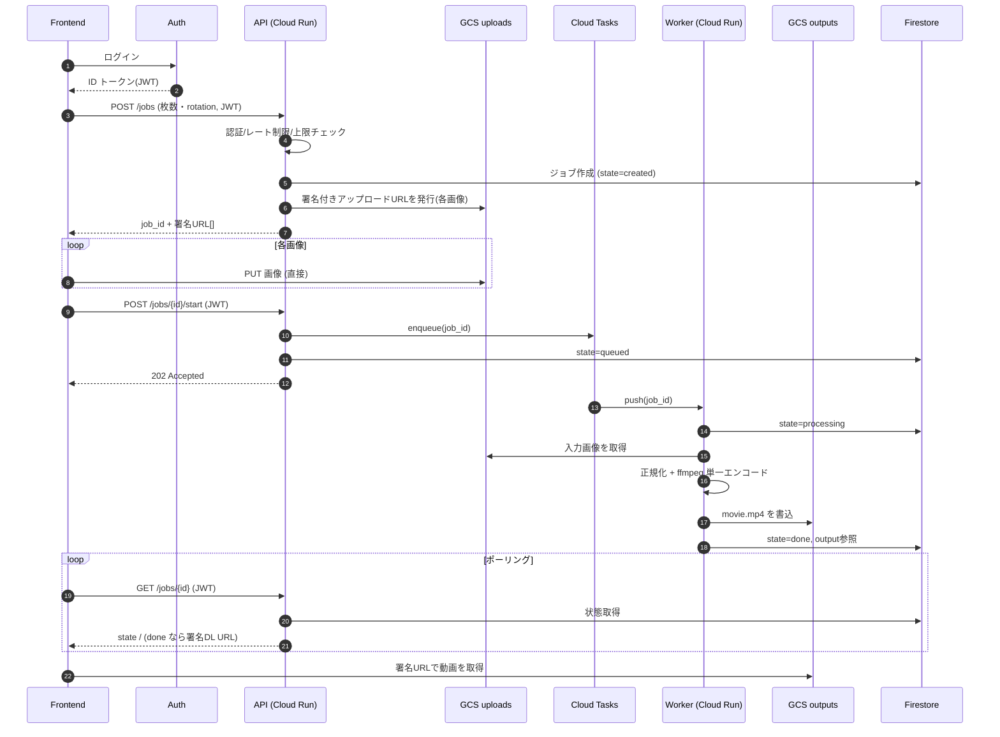
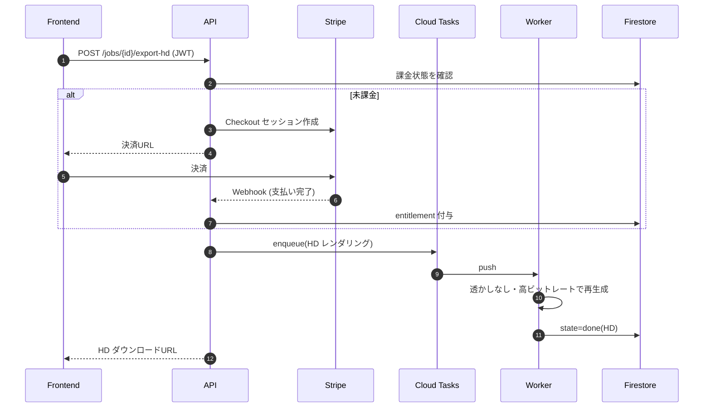
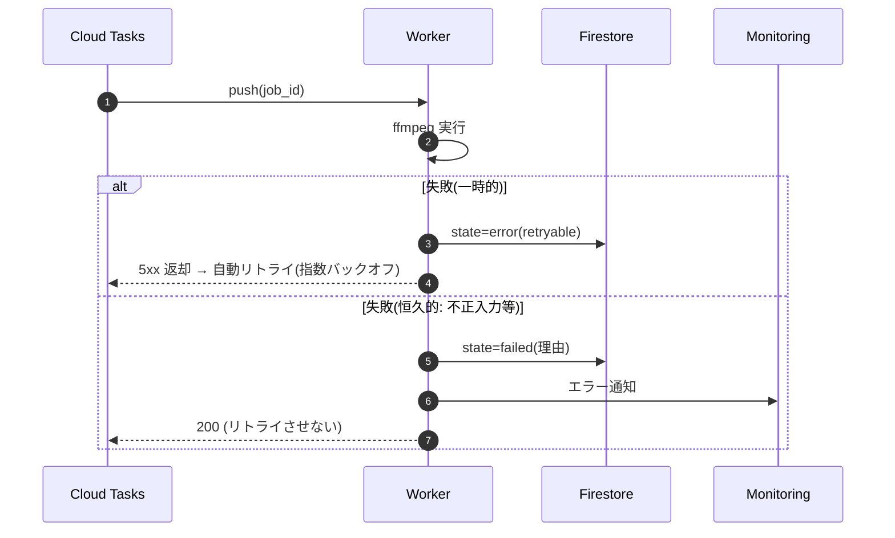
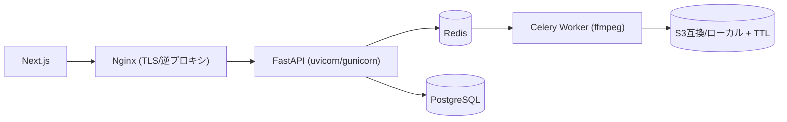

# image-movie 本番インフラ設計（詳細）

> 推奨構成：GCP マネージド（Cloud Run + Cloud Tasks + GCS + Firestore）。
> 「軽量 API」と「重いエンコード Worker」を分離し、画像/動画は **GCS へ署名付きURLで直接** 入出力する。

---

## 1. 設計原則

1. **API と エンコードを分離**：ffmpeg は CPU バウンドで時間がかかる。API スレッドをブロックさせず、キュー経由で Worker に渡す。
2. **大容量データは API を経由させない**：アップロード/ダウンロードは GCS の **署名付きURL** でクライアント ↔ ストレージ直結。API の帯域・メモリを節約。
3. **状態はマネージドに置く**：ジョブ状態・ユーザー・課金は Firestore（or Cloud SQL）。Worker/API はステートレスに保ち水平スケール可能に。
4. **使い捨て・自動削除**：入出力は GCS ライフサイクルで TTL 自動削除（プライバシー & コスト）。
5. **濫用前提で守る**：認証・レート制限・サイズ/枚数上限・コンテンツ検査・署名URLの短期失効。

---

## 2. コンテナ構成図（C4: Container レベル）

---

## 3. ユースケース図

- 匿名でも「生成 → 透かし付きプレビュー/DL」まで可能（CV 前の体験を最大化）。
- HD・透かしなしは課金ユーザー限定。BGM/テンプレ選択は登録で開放。

---

## 4. シーケンス図

### 4.1 動画生成（ハッピーパス：署名URL直アップロード方式・推奨）

> 補足：MVP では「API がアップロードを受けて自分で GCS に置く」簡易版でも可。
> ただし大量/大容量画像では API 帯域・メモリを圧迫するため、本番は署名URL直アップロードを推奨。

### 4.2 HD 書き出し（課金フロー）

### 4.3 失敗・リトライ

---

## 5. 各コンポーネント詳細

| 層 | 採用 | 主設定/ポイント |
|---|---|---|
| フロント | Next.js / Vercel | 静的配信 + CDN。`NEXT_PUBLIC_API_BASE_URL` で API 切替 |
| API | Cloud Run | min-instances=0〜1、concurrency 高め。CPU 控えめ。役割：認証・署名URL発行・ジョブ管理・課金 |
| キュー | Cloud Tasks | 1ジョブ=1タスク。最大試行回数・バックオフ・ディスパッチ並列度を設定 |
| Worker | Cloud Run | CPU 2〜4・メモリ多め、timeout 長め(〜数分)、concurrency=1（1本=1コンテナで安定）。min-instances=0 でアイドル課金ゼロ |
| ストレージ | GCS (uploads/outputs) | 署名URL(短期失効)。ライフサイクルで TTL 自動削除。CMEK/暗号化はデフォルト |
| DB | Firestore | ジョブ・ユーザー・entitlement。サーバレスでスケール。複雑な集計が要れば Cloud SQL |
| 認証 | Firebase Auth | メール/Google/LINE。匿名サインインで匿名利用も追跡可 |
| 決済 | Stripe | Checkout + Webhook。entitlement を Firestore に反映 |
| シークレット | Secret Manager | Stripe鍵・BGMライセンス等。末尾改行に注意 |
| 監視 | Cloud Logging/Monitoring/Error Reporting (+Sentry) | ジョブ成功率・所要時間・キュー滞留をメトリクス化 |
| CDN/配信 | 署名URL + (必要なら Cloud CDN) | 出力動画の配信。直リンク失効で保護 |

---

## 6. スケーリングと性能

- **水平スケール**：Worker は「1コンテナ=1ジョブ(concurrency=1)」。同時生成数 = Worker インスタンス数。Cloud Run が需要に応じて自動増減。
- **1本の所要**：30枚/75秒/1080p の静止フレーム libx264 は数秒〜十数秒（CPU依存）。`-preset`/`-crf` で調整。
- **重い入力の抑制**：縦型/SNS短尺/解像度プリセットを用意し 4K を既定にしない。
- **コールドスタート対策**：体験重視なら API は min-instances=1。Worker は 0 でも可（数秒の起動許容）。
- **バックプレッシャ**：Cloud Tasks のディスパッチ上限で Worker 過負荷を防止。キュー滞留はアラート。

---

## 7. セキュリティ / コンプライアンス

- 署名URL は **短期失効 + メソッド/パス限定**。アップロードは content-type/サイズ条件付き。
- API は JWT 検証 + ユーザー単位レート制限 + 1ジョブの枚数/総サイズ上限。
- 画像のコンテンツ検査（不適切画像）— SafeSearch 等を Worker 前段に。
- 出力はデフォルト非公開バケット。配信は署名URLのみ。
- **BGM 著作権**：ライセンス済み音源のみ使用 or ユーザー持ち込み（最重要・法的ブロッカー）。
- 規約/プライバシー（アップロード画像の保持期間・削除を明記）、課金時は特商法表記。

---

## 8. コスト（marginal は極小、固定費と濫用が論点）

- 1本あたり：CPU 数秒 + ストレージ数MB + 転送0.1〜0.2円 → **数円未満**。
- 固定費：Cloud Run/Firestore 最小構成は月 0〜数千円から。BGM 商用ライセンスが最大の固定費（月 数千〜2万円規模）。
- 防御：無料枠は透かし/低画質・要ログイン・TTL削除で濫用コストを抑制。

---

## 9. 代替（最安・自前運用：VPS 構成）

- 1台の VPS に API + Redis + Celery + Postgres。固定費が安い（月 数千円〜）。
- 短所：スケール・冗長化・バックアップ・監視を自前。トラフィック増で手当てが必要。
- 位置づけ：**ごく初期の検証**。需要が見えたら GCP マネージドへ移行。

---

## 10. 現状コードからの移行ステップ

1. ジョブ状態を **インメモリ → Firestore** に置換（`app/jobs.py` の差し替え）。
2. ローカル保存 → **GCS** に置換（uploads/outputs、署名URL 発行を API に追加）。
3. `BackgroundTasks` → **Cloud Tasks + Worker（同コードを worker エントリで実行）** に分離。
4. 認証（Firebase Auth）・レート制限・上限を API に追加。
5. BGM をライセンスクリア音源へ差し替え（or 持ち込み式）。
6. 監視・規約・課金（Stripe）を整備して公開。
